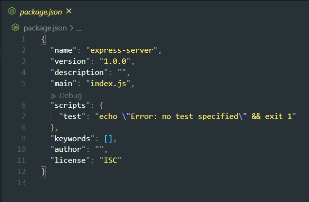
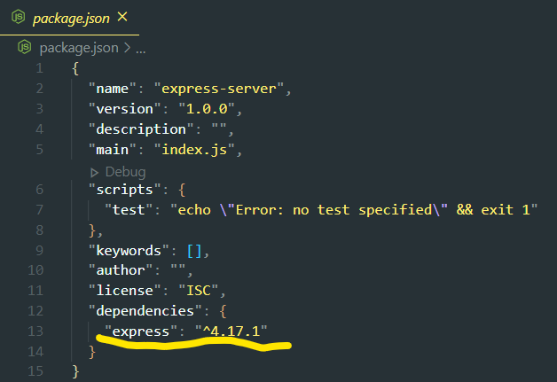
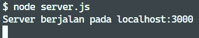
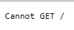
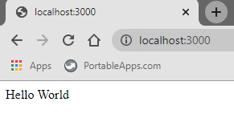
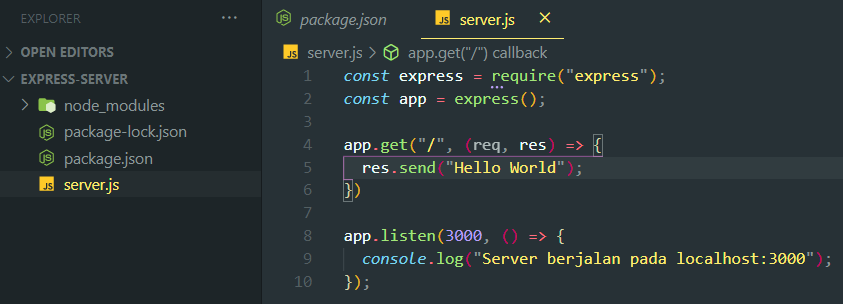

Express merupakan web framework dari **Node.js**, framework yang paling populer dikalangan developer yang bisa digunakan untuk membuat Javascript server dengan mudah dan menyenangkan.

## Sebelum memulai

Pastikan sudah ter-install Node.js di PC, gunakan *text editor* apa saja, kemudian buat folder project bernama *express-server* taruh folder dimana saja.

Open folder tersebut di text editor Setelah itu buka CMD atau Git Bash, pastikan directory *command line* merujuk ke folder project, kemudian ketik:

`npm init`

atau `npm init -y`untuk men-skip pengisian profile project.

Jika berhasil, file baru bernama *package.json* otomatis muncul



Di Command line, install Express.js dengan mengetik `npm install express`, cek kembali file package.json maka express.js berhasil di install



## Hello world pertama

Tambah file baru pada project dengan nama *server.js,* dalam file import express seperti ini:

```javascript
const express = require("express");
const app = express(); 
```

 Express sudah di import ke dalam project, selanjutnya mengatur port server agar bisa di *running locally* pada browser

```javascript
const express = require("express");
const app = express(); 

app.listen(3000, ()=> {
  console.log("Server berjalan pada localhost:3000");
});
```

Jalankan server melalui command line dengan ketik `node server.js`maka server akan berjalan secara local



Buka `localhost:3000`dibrowser, server memang sudah berjalan namun belum menentukan *route endpoint* nya maka dibrowser akan seperti ini



Tambahkan baris kode ini tepat diatas `app.listen()` dan save

```javascript
app.get("/", (req, res) => {
  res.send("Hello world!");
});
```

Penjelasannya, `.get()` merupakan salah satu HTTP method/function, yang mana menerima sebuah parameter dan *callback function* ,parameter pertama `"/"` menentukan routing yang akan digunakan, dalam kasus ini me-route ke root halaman pertama. Kemudian *argument* kedua menerima *callback function,* pada callback function menerima juga dua *argument* juga disebut dengan *callback argument,* `(req, res) => {}`

*req* singkatan dari *request* dan *res* untuk *response,* dalam kasus ini hanya memanggil parameter *res* saja, `res.send("Hello world!);` menggunakan method *send* yang disediakan *express* kemudian akan meresponnya dengan menampilkan pesan **hello world** di halaman browser.

Buka command line dan quit dari server yang dijalankan sebelumnya dengan menekan `ctrl + C` kemudian jalankan server lagi, `node server.js`, buka browser dan refresh page tadi, jika berhasil maka page tersebut menampilkan `Hello world!`



Keseluruhan file project seperti ini:

