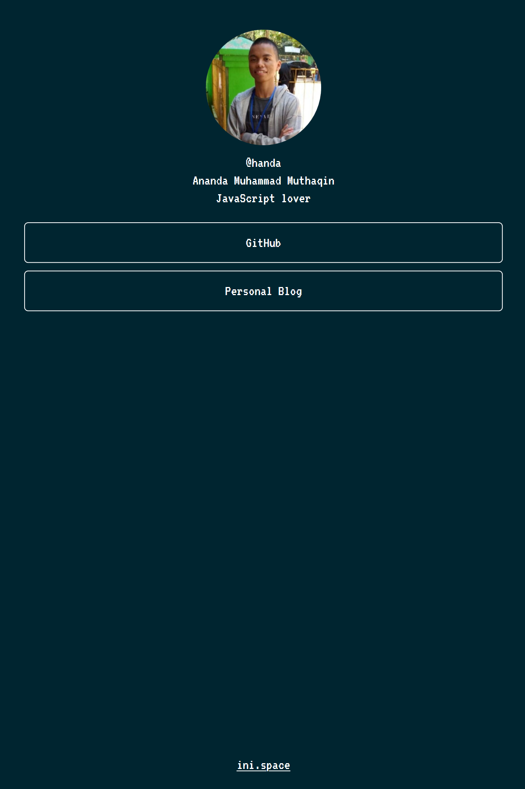
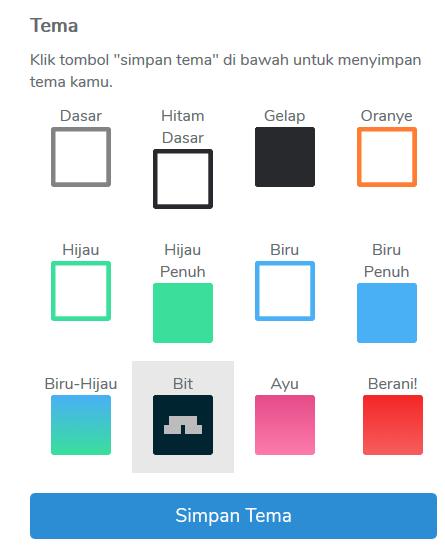

Baru-baru saja mas Hilman Ramadhan, founder [Sekolah Koding](https://sekolahkoding.com/), melaunching [Ini Space](https://ini.space/) sebuah situs web untuk menyimpan banyak link di satu tempat, cukup simple memang tapi situs ini sangat cocok untuk pelaku usaha yang notabene punya banyak kontak untuk usahanya seperti nomor WA, akun IG, link *Online Shop* mereka, dengan adanya [Ini Space](https://ini.space/), pengguna cukup cantumkan akun-akun atau nomor kontak dalam satu wadah dan nantinya semua link tersebut bisa diakses dalam satu wadah.

Untuk yang masih bingung bagaimana cara kerjanya, simak video [Cara memasang banyak link di satu tempat menggunakan ini.space](https://www.youtube.com/watch?v=Xv67Y-6U-nM), selain untuk pelaku usaha, ini juga bisa dipakai buat keperluan pribadi , mencantumkan akun-akun sosial media dalam satu wadah/ satu link seperti punya saya sendiri:

bisa di cek <https://ini.space/handa>, disitu saya hanya mencantumkan akun GitHub dan link blog saya sendiri dan bisa diakses dengan satu link saja yang sudah saya sematkan sebelumnya.

Pengguna juga bisa memilih beberapa tema yang sudah tersedia, tema yang saya gunakan tema *bit / retro* style, 

Untuk situsnya sendiri juga masih perlu pengembangan jadi wajar jika ada suatu bug, mungkin kedepannya terdapat fitur-fitur menarik yang akan mendatang. Disamping itu, situs ini sangat bermanfaat ,inovatif, dan keren menurut saya. Ayo coba sekarang juga [ini.space kamu](https://ini.space/).